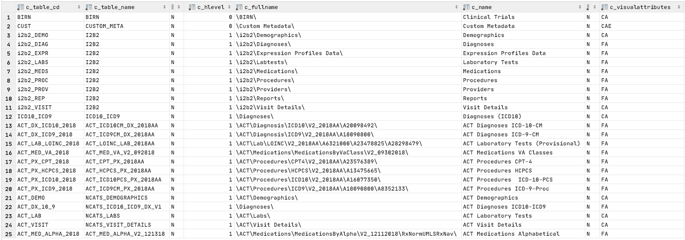
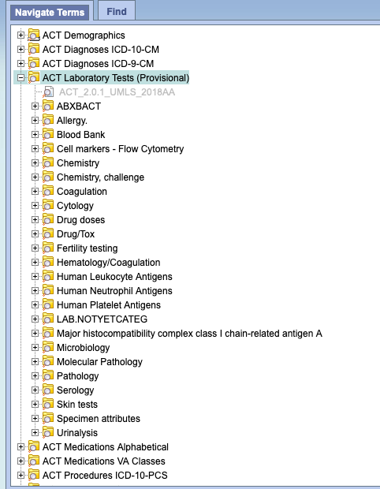
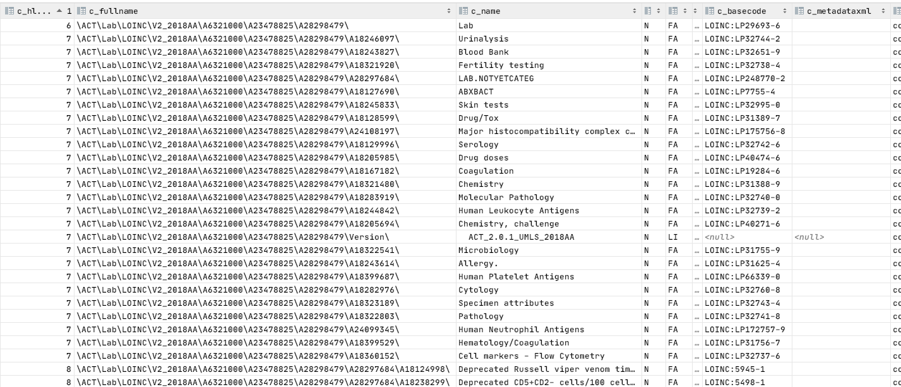

# Ontology Representation
The root or "entry points" to the ontology are derived from the `table_access` table:

The `c_name` property is what becomes the root node in the ontology navigation table.

The `c_fullname` identifies the root path in the table itself.  As an example, if we open the `ACT_LAB_LOINC_2018` table,
the hierarchy starts at:

This corresponds to the base rows in the `ACT_LOINC_LAB_2018AA` that begin with `\ACT\Lab\LOINC\V2_2018AA\A6321000\A23478825\A28298479\`:

Note that the first row (`c_hlevel` = 6) uses the name from the `table_access` table.  The `FA` `c_visualattributes` indicates
that the root concept is 'draggable' (e.g. that one can construct a query for ALL laboratory tests).

##  `c_visualattribute`
### First character
This attribute carries a wealth of information. For the `CONCEPT_DIMENSION` table first character can be one of:
* 'C' - an "abstract" non-leaf node.  Cannot be used in a query
* 'F' - a non-leaf node.  Typically resolves to multiple concept codes when used in a query
* 'L' - a leaf node.  Resolves to exactly one concept code in the concept dimension
* 'M' - a leaf node, but may resolve to more than one concept in the concept dimension

Note that there are equivalent codes for the modifier dimension - 'O', 'D', 'R' that correspond to 'C', 'F' and 'L'. The
reason that there are separate codes is because modifiers are represented differently in the web client window.

### Second character
* 'A' - node is active and selectable
* 'I' - node is inactive and shows as greyeed out (see: 'Version' entry)
* 'H' - node does not appear on hierarchy screen

### Third character
* ' ' - node cannot be edited
* 'E' - node is editable (we ignore this characteristic for the time being)

